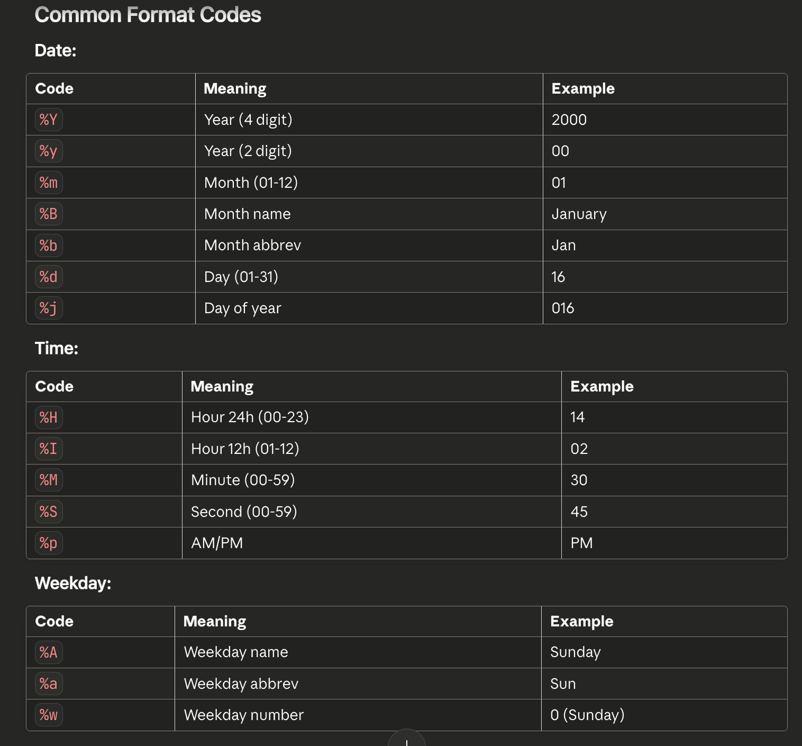

## LeetCode Problems Solved (Pandas)

**Total Solved: 109 problems** | **Difficulty: All Easy**

| # | Problem ID | Difficulty | Problem Name |
|---|:----------:|:----------:|:-------------|
| 1 | 175 | Easy | [Combine Two Tables](https://leetcode.com/problems/combine-two-tables/) |
| 2 | 181 | Easy | [Employees Earning More Than Their Managers](https://leetcode.com/problems/employees-earning-more-than-their-managers/) |
| 3 | 182 | Easy | [Duplicate Emails](https://leetcode.com/problems/duplicate-emails/) |
| 4 | 183 | Easy | [Customers Who Never Order](https://leetcode.com/problems/customers-who-never-order/) |
| 5 | 196 | Easy | [Delete Duplicate Emails](https://leetcode.com/problems/delete-duplicate-emails/) |
| 6 | 197 | Easy | [Rising Temperature](https://leetcode.com/problems/rising-temperature/) |
| 7 | 511 | Easy | [Game Play Analysis I](https://leetcode.com/problems/game-play-analysis-i/) |
| 8 | 512 | Easy | [Game Play Analysis II](https://leetcode.com/problems/game-play-analysis-ii/) |
| 9 | 577 | Easy | [Employee Bonus](https://leetcode.com/problems/employee-bonus/) |
| 10 | 584 | Easy | [Find Customer Referee](https://leetcode.com/problems/find-customer-referee/) |
| 11 | 586 | Easy | [Customer Placing the Largest Number of Orders](https://leetcode.com/problems/customer-placing-the-largest-number-of-orders/) |
| 12 | 595 | Easy | [Big Countries](https://leetcode.com/problems/big-countries/) |
| 13 | 596 | Easy | [Classes More Than 5 Students](https://leetcode.com/problems/classes-more-than-5-students/) |
| 14 | 597 | Easy | [Friend Requests I: Overall Acceptance Rate](https://leetcode.com/problems/friend-requests-i-overall-acceptance-rate/) |
| 15 | 603 | Easy | [Consecutive Numbers](https://leetcode.com/problems/consecutive-numbers/) |
| 16 | 610 | Easy | [Triangle Judgement](https://leetcode.com/problems/triangle-judgement/) |
| 17 | 613 | Easy | [Shortest Distance in a Line](https://leetcode.com/problems/shortest-distance-in-a-line/) |
| 18 | 619 | Easy | [Big Countries](https://leetcode.com/problems/big-countries/) |
| 19 | 620 | Easy | [Not Boring Movies](https://leetcode.com/problems/not-boring-movies/) |
| 20 | 1068 | Easy | [Product Sales Analysis III](https://leetcode.com/problems/product-sales-analysis-iii/) |
| 21 | 1069 | Easy | [Product Sales Analysis IV](https://leetcode.com/problems/product-sales-analysis-iv/) |
| 22 | 1075 | Easy | [Project Employees I](https://leetcode.com/problems/project-employees-i/) |
| 23 | 1076 | Easy | [Project Employees II](https://leetcode.com/problems/project-employees-ii/) |
| 24 | 1082 | Easy | [Sales Analysis I](https://leetcode.com/problems/sales-analysis-i/) |
| 25 | 1083 | Easy | [Sales Analysis II](https://leetcode.com/problems/sales-analysis-ii/) |
| 26 | 1084 | Easy | [Sales Analysis III](https://leetcode.com/problems/sales-analysis-iii/) |
| 27 | 1141 | Easy | [User Activity for the Past 30 Days I](https://leetcode.com/problems/user-activity-for-the-past-30-days-i/) |
| 28 | 1142 | Easy | [User Activity for the Past 30 Days II](https://leetcode.com/problems/user-activity-for-the-past-30-days-ii/) |
| 29 | 1173 | Easy | [Immediate Food Delivery I](https://leetcode.com/problems/immediate-food-delivery-i/) |
| 30 | 1179 | Easy | [Reformat Department Table](https://leetcode.com/problems/reformat-department-table/) |
| 31 | 1211 | Easy | [Queries Quality and Percentage](https://leetcode.com/problems/queries-quality-and-percentage/) |
| 32 | 1241 | Easy | [Number of Comments per Post](https://leetcode.com/problems/number-of-comments-per-post/) |
| 33 | 1280 | Easy | [Students and Examinations](https://leetcode.com/problems/students-and-examinations/) |
| 34 | 1303 | Easy | [Find the Team Size](https://leetcode.com/problems/find-the-team-size/) |
| 35 | 1322 | Easy | [Ads Performance](https://leetcode.com/problems/ads-performance/) |
| 36 | 1327 | Easy | [List the Products Ordered in a Period](https://leetcode.com/problems/list-the-products-ordered-in-a-period/) |
| 37 | 1350 | Easy | [Students With Invalid Departments](https://leetcode.com/problems/students-with-invalid-departments/) |
| 38 | 1378 | Easy | [Replace Employee ID With The Unique Identifier](https://leetcode.com/problems/replace-employee-id-with-the-unique-identifier/) |
| 39 | 1421 | Easy | [NPV Queries](https://leetcode.com/problems/npv-queries/) |
| 40 | 1435 | Easy | [Create a Session Bar Chart](https://leetcode.com/problems/create-a-session-bar-chart/) |
| 41 | 1484 | Easy | [Group Sold Products By The Date](https://leetcode.com/problems/group-sold-products-by-the-date/) |
| 42 | 1495 | Easy | [Friendly Movies Streamed Last Month](https://leetcode.com/problems/friendly-movies-streamed-last-month/) |
| 43 | 1511 | Easy | [Customer Orders Frequency](https://leetcode.com/problems/customer-orders-frequency/) |
| 44 | 1517 | Easy | [Find Users With Valid E-Mails](https://leetcode.com/problems/find-users-with-valid-e-mails/) |
| 45 | 1527 | Easy | [Patients With a Condition](https://leetcode.com/problems/patients-with-a-condition/) |
| 46 | 1543 | Easy | [Fix Product Name Format](https://leetcode.com/problems/fix-product-name-format/) |
| 47 | 1565 | Easy | [Unique Orders and Customers Per Month](https://leetcode.com/problems/unique-orders-and-customers-per-month/) |
| 48 | 1571 | Easy | [Warehouse Manager](https://leetcode.com/problems/warehouse-manager/) |
| 49 | 1587 | Easy | [Bank Account Summary](https://leetcode.com/problems/bank-account-summary/) |
| 50 | 1607 | Easy | [Sellers With No Sales](https://leetcode.com/problems/sellers-with-no-sales/) |
| 51 | 1623 | Easy | [All Valid Triplets That Can Represent a Country](https://leetcode.com/problems/all-valid-triplets-that-can-represent-a-country/) |
| 52 | 1633 | Easy | [Percentage of Users Attended a Contest](https://leetcode.com/problems/percentage-of-users-attended-a-contest/) |
| 53 | 1661 | Easy | [Average Time of Process per Machine](https://leetcode.com/problems/average-time-of-process-per-machine/) |
| 54 | 1667 | Easy | [Fix Names in a Table](https://leetcode.com/problems/fix-names-in-a-table/) |
| 55 | 1677 | Easy | [Product's Worth Over Invoices](https://leetcode.com/problems/products-worth-over-invoices/) |
| 56 | 1683 | Easy | [Invalid Tweets](https://leetcode.com/problems/invalid-tweets/) |
| 57 | 1731 | Easy | [The Number of Employees Who Met the Target](https://leetcode.com/problems/the-number-of-employees-who-met-the-target/) |
| 58 | 1741 | Easy | [Find Total Time Spent by Each Employee](https://leetcode.com/problems/find-total-time-spent-by-each-employee/) |
| 59 | 1777 | Easy | [Product's Price for Each Store](https://leetcode.com/problems/products-price-for-each-store/) |
| 60 | 1789 | Easy | [Primary Department for Each Employee](https://leetcode.com/problems/primary-department-for-each-employee/) |
| 61 | 1795 | Easy | [Rearrange Products Table](https://leetcode.com/problems/rearrange-products-table/) |
| 62 | 1809 | Easy | [Ad-Free Sessions](https://leetcode.com/problems/ad-free-sessions/) |
| 63 | 1821 | Easy | [Find Customers With Positive Revenue this Year](https://leetcode.com/problems/find-customers-with-positive-revenue-this-year/) |
| 64 | 1853 | Easy | [Convert Date Format](https://leetcode.com/problems/convert-date-format/) |
| 65 | 1890 | Easy | [The Latest Login in 2020](https://leetcode.com/problems/the-latest-login-in-2020/) |
| 66 | 1939 | Easy | [Users That Actively Request Confirmation Messages](https://leetcode.com/problems/users-that-actively-request-confirmation-messages/) |
| 67 | 1978 | Easy | [Employees Whose Manager Left the Company](https://leetcode.com/problems/employees-whose-manager-left-the-company/) |
| 68 | 2026 | Easy | [Low Quality Problems](https://leetcode.com/problems/low-quality-problems/) |
| 69 | 2072 | Easy | [The Winner University](https://leetcode.com/problems/the-winner-university/) |
| 70 | 2082 | Easy | [The Number of Rich Customers](https://leetcode.com/problems/the-number-of-rich-customers/) |
| 71 | 2205 | Easy | [The Number of Users That Are Eligible for Discount](https://leetcode.com/problems/the-number-of-users-that-are-eligible-for-discount/) |
| 72 | 2230 | Easy | [The Users That Are Eligible for Discount](https://leetcode.com/problems/the-users-that-are-eligible-for-discount/) |
| 73 | 2329 | Easy | [Product Sales Analysis IV](https://leetcode.com/problems/product-sales-analysis-iv/) |
| 74 | 2339 | Easy | [All the Matches of the League](https://leetcode.com/problems/all-the-matches-of-the-league/) |
| 75 | 2356 | Easy | [Number of Unique Subjects Taught by Each Teacher](https://leetcode.com/problems/number-of-unique-subjects-taught-by-each-teacher/) |
| 76 | 2377 | Easy | [Sort the Olympic Table](https://leetcode.com/problems/sort-the-olympic-table/) |
| 77 | 2480 | Easy | [Form a Chemical Bond](https://leetcode.com/problems/form-a-chemical-bond/) |
| 78 | 2504 | Easy | [Concatenate the Name and the Department Number](https://leetcode.com/problems/concatenate-the-name-and-the-department-number/) |
| 79 | 2668 | Easy | [Find Latest Salaries](https://leetcode.com/problems/find-latest-salaries/) |
| 80 | 2669 | Easy | [Count Artist Occurrences On Spotify Ranking List](https://leetcode.com/problems/count-artist-occurrences-on-spotify-ranking-list/) |
| 81 | 2687 | Easy | [Bikes Last Time Used](https://leetcode.com/problems/bikes-last-time-used/) |
| 82 | 2837 | Easy | [Total Traveled Distance](https://leetcode.com/problems/total-traveled-distance/) |
| 83 | 2853 | Easy | [Highest Salaries Difference](https://leetcode.com/problems/highest-salaries-difference/) |
| 84 | 2877 | Easy | [Create a DataFrame from List](https://leetcode.com/problems/create-a-dataframe-from-list/) |
| 85 | 2878 | Easy | [Get the Size of a DataFrame](https://leetcode.com/problems/get-the-size-of-a-dataframe/) |
| 86 | 2879 | Easy | [Display the First Three Rows](https://leetcode.com/problems/display-the-first-three-rows/) |
| 87 | 2880 | Easy | [Select Data](https://leetcode.com/problems/select-data/) |
| 88 | 2881 | Easy | [Create a New Column](https://leetcode.com/problems/create-a-new-column/) |
| 89 | 2882 | Easy | [Drop Duplicate Rows](https://leetcode.com/problems/drop-duplicate-rows/) |
| 90 | 2883 | Easy | [Drop Missing Data](https://leetcode.com/problems/drop-missing-data/) |
| 91 | 2884 | Easy | [Modify Columns](https://leetcode.com/problems/modify-columns/) |
| 92 | 2885 | Easy | [Rename Columns](https://leetcode.com/problems/rename-columns/) |
| 93 | 2886 | Easy | [Change Data Type](https://leetcode.com/problems/change-data-type/) |
| 94 | 2887 | Easy | [Fill Missing Data](https://leetcode.com/problems/fill-missing-data/) |
| 95 | 2888 | Easy | [Reshape Data: Concatenate](https://leetcode.com/problems/reshape-data-concatenate/) |
| 96 | 2889 | Easy | [Reshape Data: Pivot](https://leetcode.com/problems/reshape-data-pivot/) |
| 97 | 2890 | Easy | [Reshape Data: Melt](https://leetcode.com/problems/reshape-data-melt/) |
| 98 | 2891 | Easy | [Method Chaining](https://leetcode.com/problems/method-chaining/) |
| 99 | 2985 | Easy | [Calculate Compressed Mean](https://leetcode.com/problems/calculate-compressed-mean/) |
| 100 | 2987 | Easy | [Find Expensive Cities](https://leetcode.com/problems/find-expensive-cities/) |
| 101 | 2990 | Easy | [Loan Types](https://leetcode.com/problems/loan-types/) |
| 102 | 3051 | Easy | [Find Candidates for Data Scientist Position](https://leetcode.com/problems/find-candidates-for-data-scientist-position/) |
| 103 | 3053 | Easy | [Classifying Triangles by Lengths](https://leetcode.com/problems/classifying-triangles-by-lengths/) |
| 104 | 3059 | Easy | [Find All Unique Email Domains](https://leetcode.com/problems/find-all-unique-email-domains/) |
| 105 | 3150 | Easy | [Invalid Tweets II](https://leetcode.com/problems/invalid-tweets-ii/) |
| 106 | 3172 | Easy | [Second Day Verification](https://leetcode.com/problems/second-day-verification/) |
| 107 | 3198 | Easy | [Find Cities in Each State](https://leetcode.com/problems/find-cities-in-each-state/) |
| 108 | 3246 | Easy | [Premier League Table Ranking](https://leetcode.com/problems/premier-league-table-ranking/) |
| 109 | 3358 | Easy | [Books with NULL Ratings](https://leetcode.com/problems/books-with-null-ratings/) |


#### 1. how to aggregate data in pandas?
- use `groupby()` to group the data by a column
- use `agg()` to aggregate the data by a column
- use `size()` to get the number of rows in each group
- use `reset_index()` to convert the Series to a DataFrame
```python
df.groupby('column').agg({'other_column': 'mean'}) # mean, median, sum, size(all values including null values), count(all non-null values), max, min, first(the first value), last(the last value)
df.groupby("class").size().reset_index(name='count') # reset_index() is used to convert the Series to a DataFrame
df["count"].max() # get the maximum value of the "count" column, it is not a dataframe but a value

# multiple aggregations and custom aggregation functions with rename for the columns
def queries_stats(queries: pd.DataFrame) -> pd.DataFrame:
    queries["quality_ratio"] = queries["rating"] / queries["position"]
    queries["is_poor"] = queries["rating"] < 3

    filtered = queries.groupby("query_name").agg(
        quality=("quality_ratio", "mean"),
        poor_query_percentage=("is_poor", lambda x: x.sum() / x.count() * 100)
    ).round(2)

    return filtered.reset_index()

# Use lambda function to create a new column with the percentage of poor queries
# x.sum() is used to count the number of True values in the "is_poor" column
# x.count() is used to count the number of values in the "is_poor" column
# lambda x: x.sum() / x.count() * 100 is used to calculate the percentage of poor queries
# round(2) is used to round the result to 2 decimal places (for two columns, the entire dataframe will be rounded to 2 decimal places)
# reset_index() is used to convert the Series to a DataFrame
# quality_ratio is the mean of the "quality_ratio" column
# poor_query_percentage is the percentage of poor queries
# query_name is the name of the query

```

#### 2. how to merge data in pandas?
```python
df.merge(other_df, on='key', how="left")
df.merge(other_df, left_on='key_a', right_on='key_b', how="left") # left_on and right_on are used to specify the columns to merge on
df.merge(df, on="key", how="left", suffixes=("_left", "_right")) # suffixes are used to specify the suffixes of the columns to merge on (self-join)
```

#### 3. how to sort data in pandas?
```python
df.sort_values('column', ascending=False, inplace=True)
df.sort_values(['column1', 'column2'], ascending=[False, True], inplace=True)
df.sort_values(by=['column1', 'column2'], ascending=[False, True], inplace=True) # same as above
```

#### 4. how to filter data in pandas?
```python
df[df['column'] > value]
df[(df['column1'] > value1) and (df['column2'] > value2)] # filter by multiple conditions
```

#### 5. how to rename columns in pandas?
```python
df.rename(columns={'old': 'new'}, inplace=True) # don't forget to add columns={'old': 'new'} to save the changes
```

#### 6. how to add and shift columns in pandas?
```python
df['new_column'] = value # add a new column
df['new_column'] = df['column'] + 1 # add the value of the "column" column to the "new_column" column
df['new_column'] = df['column'].shift(1) # shift the value of the "column" column to the "new_column" column (get the previous value)
df['new_column'] = df['column'].shift(-1) # shift the value of the "column" column to the "new_column" column (get the next value)
```

#### 7. how to compare Timedelta in pandas? (pd.to_datetime(), pd.Timedelta(days=1), pd.strftime())
```python
# 1. how to compare Timedelta in pandas?
weather["record_date"] - weather["previous_date"] == pd.Timedelta(days=1) # compare the value of the "record_date" column to the "previous_date" column (get the difference)    
# convert date column to datetime in pandas
weather["record_date"] = pd.to_datetime(weather["record_date"])
weather["previous_date"] = pd.to_datetime(weather["previous_date"])

# 2. how to use dt.day, dt.month, dt.year, dt.hour, dt.minute, dt.second in pandas?
weather["record_date"] = pd.to_datetime(weather["record_date"])

weather["record_date"].dt.day # get the day of the week
weather["record_date"].dt.month # get the month of the year
weather["record_date"].dt.year # get the year of the month
weather["record_date"].dt.hour # get the hour of the day
weather["record_date"].dt.minute # get the minute of the hour
weather["record_date"].dt.second # get the second of the minute

# 3. how to use pd.strftime() in pandas?
dt = pd.to_datetime("2000-01-16 14:30:45")

dt.strftime("%Y-%m-%d")       # '2000-01-16'
dt.strftime("%Y-%m")          # '2000-01'
dt.strftime("%d/%m/%Y")       # '16/01/2000'
dt.strftime("%B %d, %Y")      # 'January 09, 2000'
dt.strftime("%B %-d, %Y")     # 'January 9, 2000' %-d means no leading zero
dt.strftime("%Y-%m-%d %H:%M") # '2000-01-16 14:30'
dt.strftime("%I:%M %p")       # '02:30 PM'
dt.strftime("%A")             # 'Sunday'
# A -- day of the week (full name) Monday, Tuesday, Wednesday, etc.
# B -- month of the year (full name) January, February, March, etc.
# C -- day of the month
# D -- day of the year


## to period
s = pd.to_datetime(pd.Series(["2000-01-16", "2000-02-18"]))

s.dt.to_period("M").astype(str)  # ['2000-01', '2000-02']
s.dt.to_period("Y").astype(str)  # ['2000', '2000']
s.dt.to_period("D").astype(str)  # ['2000-01-16', '2000-02-18']

```


#### 8. how drop duplicates in pandas?
```python
df.drop_duplicates(subset=['column1', 'column2'], keep='first', inplace=True) # drop duplicates by multiple columns, keep the first occurrence
# subset is used to specify the columns to drop duplicates on
# keep can be 'first', 'last', False
# False means drop all duplicates
# 'first' means keep the first occurrence
# 'last' means keep the last occurrence
```

#### 9. how to convert data type in pandas?
```python
df['column'] = df['column'].astype('int') # convert the data type of the "column" column to int
df['column'] = df['column'].astype('float') # convert the data type of the "column" column to float
df['column'] = df['column'].astype('str') # convert the data type of the "column" column to str
df['column'] = df['column'].astype('bool') # convert the data type of the "column" column to bool
df['column'] = df['column'].astype('datetime') # convert the data type of the "column" column to datetime
```

#### 10. how to use isin() in pandas?
```python
df[df['column'].isin(df['other_column'])] # filter the data by multiple values
# isin() is used to check if the value of the "column" column is in the "other_column" column
```

#### 11. how to use Series.diff() in pandas? (same for shift(), cumsum())
```python
df['column'].diff() # get the difference between the current value and the previous value

Use diff() 
s = pd.Series([1, 4, 7, 10])
s.diff()

# 0    NaN      # No previous element
# 1    3.0      # 4 - 1 = 3
# 2    3.0      # 7 - 4 = 3
# 3    3.0      # 10 - 7 = 3

s = pd.Series([10, 20, 30])

s.shift(1)    # [NaN, 10, 20]
s.cumsum()    # [10, 30, 60]
```

#### 12. how to use pivot() and pivot_table() in pandas?
```python
df = pd.DataFrame({
    "id": [1, 1, 2],
    "month": ["Jan", "Feb", "Jan"],
    "revenue": [100, 200, 150]
})

# Long format:
#    id  month  revenue
# 0   1    Jan      100
# 1   1    Feb      200
# 2   2    Jan      150

df.pivot(index="id", columns="month", values="revenue").reset_index() # reset the index to get the original index

# Wide format:
# month  Feb    Jan
# id              
# 1      200.0  100.0
# 2      NaN    150.0


df.pivot_table(index='index', columns='column', values=['value1', 'value2'], aggfunc=['mean', 'sum']) # pivot the data by the "index" column and the "column" column, pivot_table can aggregate the data by multiple columns
# index is used to specify the column to pivot on
# columns is used to specify the column to pivot on
# values is used to specify the column to pivot on
# aggfunc is used to specify the aggregation function
# aggfunc can be 'mean', 'sum', 'min', 'max', 'count', 'std', 'var'
```

#### 13. how to use map() in column to replace the values?
```python
df['column'] = df['column'].map({'old': 'new'}) # replace the values of the "column" column with the "new" value

# e.g. map True to "Yes" and False to "No"
triangle["triangle"] = (
    (triangle["x"] + triangle["y"] > triangle["z"]) &
    (triangle["x"] + triangle["z"] > triangle["y"]) &
    (triangle["y"] + triangle["z"] > triangle["x"])
).map({True: "Yes", False: "No"})

[True, False, True].map({True: "Yes", False: "No"}) # ["Yes", "No", "Yes"]
```

#### 14. the difference between size() and count() in pandas/groupby()?
```python
df = pd.DataFrame({
    "a": [1, None, 3],
    "b": [4, 5, None]
})

df.size     # 6 (3 rows × 2 cols) as an attribute of the dataframe
df.count()  # Series: a=2, b=2 (non-null per column)


# size() and count() are different in groupby()
df = pd.DataFrame({
    "group": ["A", "A", "B"],
    "value": [1, None, 3]
})

df.groupby("group").size()
# group
# A    2
# B    1
# (counts all rows per group)

df.groupby("group").count()
# group  value
# A      1      (skips None)
# B      1

df.groupby("group").agg({"value": "nunique"}) # count the number of unique values in the "value" column 
# group  value
# A      1      (counts the number of unique values in the "value" column)
# B      1
```

#### 15. different ways to write a groupby()?
```python
sales.groupby("seller_id")["price"].sum()
sales.groupby("seller_id").agg({"price": "sum"})
sales.groupby("seller_id")["price"].agg("sum") # same as sales.groupby("seller_id")["price"].sum()
```

#### 16. pandas broadcasting for dataframe?
```python
s = pd.Series([10, 20, 30])

# Arithmetic
s + 5     # [15, 25, 35]
s - 5     # [5, 15, 25]
s * 2     # [20, 40, 60]
s / 10    # [1.0, 2.0, 3.0]

# Comparison (returns Boolean Series)
s > 15    # [False, True, True]
s < 25    # [True, True, False]
s == 20   # [False, True, False]
```

#### 17. how to use na-related functions in pandas?
```python
# check if the values are NaN or not
s = pd.Series([1, None, 3, None])

s.isna()     # [False, True, False, True]
s.isnull()   # [False, True, False, True] same as s.isna()
s.notna()    # [True, False, True, False]
s.notnull()  # [True, False, True, False] same as s.notna()


s = pd.Series([1, None, 3, None])
# fill the NaN values with 0 or "X"
s.fillna(0)     # [1, 0, 3, 0]
s.fillna("X")   # [1, "X", 3, "X"]

# Fill specific columns with different values
df.fillna({"col1": 0, "col2": "unknown", "col3": -1})


s.dropna()      # [1, 3] (all rows with NaN are dropped
df.dropna(subset=["column"]) # drop the rows with NaN in the "column" column

s.ffill()       # [1, 1, 3, 3] (fill the next value)
s.bfill()       # [1, 3, 3, NaN] (fill the previous value)
# fill with NaN for integer and float
s.fillna(np.nan)

# count the number of NaN and non-NaN values
s.isna().sum()    # count of NaN
s.notna().sum()   # count of non-NaN

# drop the rows with NaN and fill the NaN values with 0
df = pd.DataFrame({
    "a": [1, None, 3],
    "b": [None, 5, 6]
})

df.dropna()              # rows with no NaN
df.dropna(axis=1)        # columns with no NaN
df.fillna({"a": 0, "b": 99})  # different fill per column
```

#### 18. rounding in python and how to use a standard rounding function?
```python
# python always rounds to even
round(0.5)  # 0 (rounds to even)
round(1.5)  # 2 (rounds to even)
round(2.5)  # 2 (rounds to even)
round(3.5)  # 4 (rounds to even)

# use traditional rounding by using apply(round2)
round2 = lambda x: round(x + 1e-9, 2)
df.apply(round2)
# 0.00
# 1.00
# 2.00
# 3.00
```

#### 19. how to use merge on cross table? (fully connected table)
```python
merged = students.merge(subjects, how="cross").sort_values("student_id")
# how="cross" is used to create a cross table
# sort_values("student_id") is used to sort the data by the "student_id" column

# students is like this:
# student_id  student_name
# 1           John
# 2           Jane
# 3           Jim

# subjects is like this:
#   subject_name
#         Math
#         Science
#         History

# merged is like this:

#  student_id  student_name   subject_name
#           1           John         Math
#           1           John        Science
#           1           John        History
#           2           Jane        Math
#           2           Jane        Science
#           2           Jane        History
#           3           Jim         Math
#           3           Jim         Science
#           3           Jim         History
```

#### 20. how to use pivot_table() on cross table?
```python
pivot_table = pd.pivot_table(merged, values="student_id", index="student_name", columns="subject_name", aggfunc="count")
# values is used to specify the column to pivot on
# index is used to specify the column to pivot on
# columns is used to specify the column to pivot on
# aggfunc is used to specify the aggregation function

# the difference between pivot_table() and pivot() is that pivot_table() can handle missing values and pivot() cannot
# e.g.
pivot_table = pd.pivot_table(merged, values="student_id", index="student_name", columns="subject_name", aggfunc="count")
# pivot_table is like this:
# subject_name  Math  Science  History
# student_name               
# John           1       1       1
# Jane           1       1       1
# Jim            1       1       1
# the difference between pivot_table() and pivot() is that pivot_table() can handle missing values and pivot() cannot
# pivot() is like this:
# subject_name  Math  Science  History
# student_name               
# John           1       1       1
# Jane           1       1       1
# Jim            1       1       1
```

#### 21. how to use apply() in pandas?
```python

def weather_type(countries: pd.DataFrame, weather: pd.DataFrame) -> pd.DataFrame:
    filtered = weather.merge(countries, on="country_id", how="left")
    filtered = filtered[(filtered["day"] >= "2019-11-01") & (filtered["day"] <= "2019-11-30")]
    weathers = filtered.groupby("country_name").agg(
        weather_degree_avg=("weather_state", "mean")
    ).reset_index()
    def weather_convert(avg_degree):
        if avg_degree <= 15:
            return "Cold"
        elif avg_degree >= 25:
            return "Hot"
        else:
            return "Warm" 
    weathers["weather_type"] = weathers["weather_degree_avg"].apply(weather_convert)
    return weathers[["country_name", "weather_type"]].sort_values("country_name")

# apply() is used to apply a function to a column or a dataframe
# weather_convert is a function that converts the average degree to a weather type
# weather_type is a new column that contains the weather type
# country_name is the column to sort the data by

# e.g. 2

def type_of_triangle(triangles: pd.DataFrame) -> pd.DataFrame:
    def check_type_of_triangle(temp):
        a, b, c = temp["A"], temp["B"], temp["C"]
        if (a + b) <= c or (a + c) <= b or (b + c) <= a:
            return "Not A Triangle"
        else:
            if a == b and a == c:
                return "Equilateral"
            elif a == b or a == c or b == c:
                return "Isosceles"
            else:
                return "Scalene"
    # use apply() to apply the check_type_of_triangle function to each row of the dataframe
    # axis=1 is used to apply the function to each row
    # to_frame() is used to convert the Series to a DataFrame
    # rename(columns={0: "triangle_type"}) is used to rename the column to "triangle_type"
    triangles = triangles.apply(check_type_of_triangle, axis=1).to_frame().rename(columns={0: "triangle_type"})
    return triangles
    
```

#### 22. how to use query() in pandas?
```python
df_filtered = df.query("age > 30 and city == 'Berlin'")
# query() is used to filter the data by multiple conditions

df_filtered = df[(df["age"] > 30) & (df["city"] == "Berlin")]
# filter the data by multiple conditions
```

#### 23. how to use assign() in pandas?
```python
# how to use assign() to add a new column to the dataframe with a new column name
# and you and also use a lambda function to add a new column
df2 = df.assign(total=df["price"] * df["qty"])

df2 = (
    df.assign(
        total=lambda x: x["price"] * x["qty"],
        discounted=lambda x: x["total"] * 0.9,
    )
)
```

#### 24. how to use pd.str.match() in pandas?
```python
s = pd.Series(["apple", "banana", "cherry", "Apple123"])

# match - starts with pattern, match from the beginning of the string
s.str.match(r"[a-z]+")      # [True, True, True, False]

# contains - anywhere in string
s.str.contains(r"a")        # [True, True, False, False]

# fullmatch - entire string matches
s.str.fullmatch(r"[a-z]+")  # [True, True, True, False]

s.str.findall(pattern) # find all matches of the "pattern" in the "column" column
# pattern is the pattern to find all matches of in the "column" column

s.str.replace(pattern, repl) # replace the "pattern" with the "repl" value in the "column" column
# pattern is the pattern to replace in the "column" column
# repl is the value to replace the "pattern" with in the "column" column

# ^Start of string
# $End of string

# *   0 or more
# +   1 or more
# ?   0 or 1

# e.g. find all matches of the "pattern" in the "column" column
s.str.findall(r"[a-z]+") # ["apple", "banana", "cherry"]

# e.g. replace the "pattern" with the "repl" value in the "column" column
s.str.replace(r"[a-z]+", "X") # ["X", "X", "X", "X123"]

# [a-z]   Lowercase letter
# [A-Z]   Uppercase letter
# [0-9] or \d   Digit
# [a-zA-Z]   Any letter
# [a-zA-Z0-9]   Alphanumeric
# \w   Word char (letter, digit, _)
# \s   Whitespace
# .   Any character (except newline)
# \.   Literal dot

def valid_emails(users: pd.DataFrame) -> pd.DataFrame:
    pattern = r"^[a-zA-Z][a-zA-Z0-9_.\-]*@leetcode\.com$" # pattern to match the email addresses
    return users[users["mail"].str.match(pattern)]

# Without r
pattern = "^[a-zA-Z][a-zA-Z0-9_.\\-]*@leetcode\\.com$"

# With r (cleaner), recommended, otherwise you will use double backslash for each backslash
pattern = r"^[a-zA-Z][a-zA-Z0-9_.\-]*@leetcode\.com$"

# exmaple 2

def find_patients(patients: pd.DataFrame) -> pd.DataFrame:
    pattern = r"(^| )DIAB1"
    return patients[patients["conditions"].str.contains(pattern)]
```

#### 25. pd.str fucntions in pandas?
```python
s = pd.Series(["apple", "banana", "cherry", "Apple123"])

s.str.upper() # ["APPLE", "BANANA", "CHERRY", "APPLE123"]
s.str.lower() # ["apple", "banana", "cherry", "apple123"]
s.str.title() # ["Apple", "Banana", "Cherry", "Iphone15 is good"]
s.str.capitalize() # ["Apple", "Banana", "Cherry", "Iphone15 Is Good"] capitalize all words in the strings
s.str.strip() # ["apple", "banana", "cherry", "Iphone15 is good"] strip the left and right side of the string   
s.str.lstrip() # ["apple", "banana", "cherry", "Iphone15 is good"] strip the left side of the string
s.str.rstrip() # ["apple", "banana", "cherry", "Iphone15 is good"] strip the right side of the string

s.str.contains("World")      # [True, False, False, False]
s.str.contains("o", case=False)  # Case insensitive

s.str.split(" ") # ["apple", "banana", "cherry", "Iphone15 is good"] split the string by the " " character

s.str.count("@") # [0, 0, 0, 0] count the number of "@" characters in the string

s.str.replace("_", " ")           # ["data science", ...]
s.str.replace(r"\d+", "", regex=True)  # Remove digits

s.str[0] # ["a", "b", "c", "A"] get the first character of the string
s.str[-1] # ["e", "a", "y", "3"] get the last character of the string
s.str[0:3] # ["app", "ban", "che", "App"] get the first 3 characters of the string
s.str[-3:] # ["ple", "ana", "ry", "123"] get the last 3 characters of the string
s.str[::2] # ["a", "b", "c", "A"] get every other character of the string
s.str[::-1] # ["321ppe", "ana", "y", "A"] reverse the string
s.str[::-2] # ["321ppe", "ana", "y", "A"] reverse the string and get every other character of the string
s.str[::-3] # ["321ppe", "ana", "y", "A"] reverse the string and get every other character of the string

s.str.len()  # [15, 6, 12, 14]

s.str.startswith("data")  # [False, False, True, False]
s.str.endswith(".com")    # [False, False, False, True]

s.str.match(r"[a-z]+")  # [False, False, True, True]
```

#### 26. how to use traditional rounding function in pandas?
```python
# method 1
round2 = lambda x: round(x + 1e-9, 2)
df.apply(round2)
# 0.00
# 1.00
# 2.00
# 3.00

# method 2
np.floor(x + 0.5)

# method 3
(pd.Series([0.0, 0.5, 1.0, 1.5, 2.0]) + 0.5).astype(int) # [0, 1, 1, 2, 2] round up the values  
```

#### 27. how to use pd.loc() in pandas?
```python
# Select rows AND columns, then assign
df.loc[condition, "column"] = new_value
```

#### 28. how to use melt() in pandas?
```python
melt() Parameters
# Parameter Description
| Parameter   | Description                                |
|-------------|--------------------------------------------|
| id_vars     | Columns to keep as-is                      |
| value_vars  | Columns to unpivot (default: all others)   |
| var_name    | Name for the "variable" column             |
| value_name  | Name for the "value" column                |

df.melt(
    id_vars=["product_id"],
    value_vars=["store1", "store2", "store3"], # default: all others
    var_name="store", # name for the "variable" column same as columns in pivot()
    value_name="price" # name for the "value" column same as values in pivot()
) 

# melt the data by the "product_id" column and the "store" column, the "price" column is the value of the "store" column
# the result is like this:
# product_id store  price
# 0          1  store1   10
# 1          1  store2   20
# 2          1  store3   30   

# pivot vs melt
# pivot: long → wide
df.pivot(index="product_id", columns="store", values="price")

# melt: wide → long
df.melt(id_vars="product_id", var_name="store", value_name="price")
```


#### 30. how to use merge on cross table? (fully connected table)
```python
result = teams.merge(teams, how="cross") (n * n combinations)
# n is the number of rows in the "teams" dataframe
# result is like this:
# team_name   team_name   |
#-------------|-------------|
# Leetcode FC | Leetcode FC |
# Leetcode FC | Ahly SC     |
# Leetcode FC | Real Madrid |
# Ahly SC     | Leetcode FC |
# Ahly SC     | Ahly SC     |
# Ahly SC     | Real Madrid |
# Real Madrid | Leetcode FC |
# Real Madrid | Ahly SC     |
# Real Madrid | Real Madrid |
```

#### 31. how to create a new dataframe in pandas?
```python
import pandas as pd

data = [[1, "Alice", 100], [2, "Bob", 200]]

df = pd.DataFrame(data, columns=["id", "name", "salary"])
#    id   name  salary
# 0   1  Alice     100
# 1   2    Bob     200
```

#### 32. how to use pd.iloc() in pandas? (data frame slicing)
```python
df.iloc[0] # [1, "Alice", 100] get the first row
df.iloc[0:2] # [[1, "Alice", 100], [2, "Bob", 200]] get the first 2 rows
df.iloc[0:2, 0:2] # [[1, "Alice"], [2, "Bob"]] get the first 2 rows and the first 2 columns

# First 3 rows
df.head(3)
# or
df.iloc[:3]

# Remove last column
df.iloc[:, :-1]

# Both: first 3 rows, remove last column
df.iloc[:3, :-1]
```

#### 33. how to use pd.concat() in pandas?
```python
pd.concat([df1, df2]) # concatenate the two dataframes
pd.concat([df1, df2], axis=1) # concatenate the two dataframes horizontally
pd.concat([df1, df2], axis=0, ignore_index=True) # concatenate the two dataframes vertically and ignore the index, and reset the index
# ignore_index=True is used to ignore the index of the two dataframes
# axis=0 is used to concatenate the two dataframes vertically
# axis=1 is used to concatenate the two dataframes horizontally
```

#### 34. how to use rank() in pandas?
```python
df = pd.DataFrame({
    "name": ["Alice", "Bob", "Charlie", "David"],
    "score": [85, 92, 85, 78]
})

df["rank"] = df["score"].rank()
#      name  score  rank
# 0   Alice     85   2.5
# 1     Bob     92   4.0
# 2  Charlie    85   2.5
# 3   David     78   1.0

# method can be "average", "min", "max", "first", "dense"
# average: the average rank in the group 1, 2.5, 2.5, 4
# min: the smallest rank in the group 1, 2, 2, 3
# max: the largest rank in the group 1, 3, 3, 4
# first: the first rank in the group 1, 2, 3, 4
# dense: the dense rank in the group 1, 2, 2, 3

df["score"] = [85, 92, 85, 78]

df["score"].rank(method="average")  # [2.5, 4.0, 2.5, 1.0]
df["score"].rank(method="min")      # [2.0, 4.0, 2.0, 1.0]
df["score"].rank(method="max")      # [3.0, 4.0, 3.0, 1.0]
df["score"].rank(method="first")    # [2.0, 4.0, 3.0, 1.0]
df["score"].rank(method="dense")    # [2.0, 3.0, 2.0, 1.0]

df["rank"] = df["score"].rank(ascending=False)
#      name  score  rank
# 0   Alice     85   2.5
# 1     Bob     92   1.0   ← highest score = rank 1
# 2  Charlie    85   2.5
# 3   David     78   4.0
# ascending=False is used to rank the data in descending order
# ascending=True is used to rank the data in ascending order

# method can be "average", "min", "max", "first", "dense"
# ascending=False: the highest score = rank 1
# ascending=True: the lowest score = rank 1
```